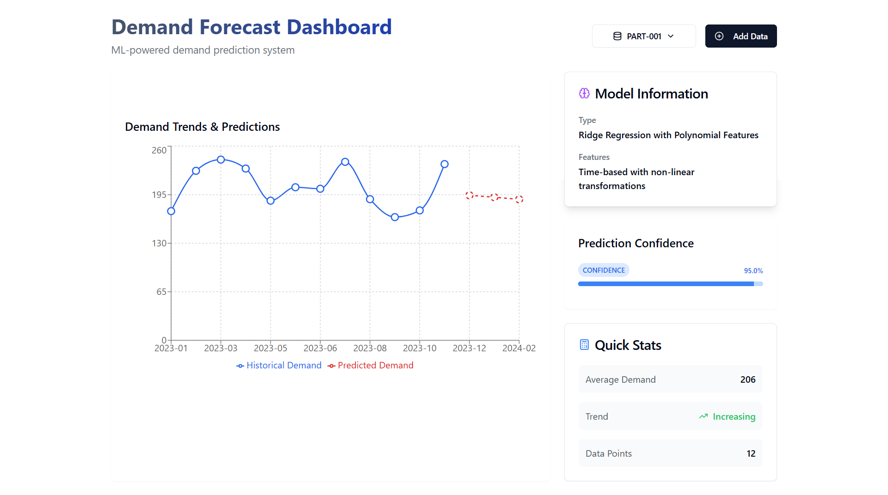

# Demand Forecast Dashboard

A machine learning-powered dashboard for forecasting product demand, built with React and Python Flask. The system uses Ridge Regression with polynomial features to predict future demand based on historical data.



## Features

- 📊 Interactive demand visualization with historical and predicted data
- 🤖 ML-powered demand forecasting using Ridge Regression
- 📈 Real-time confidence scoring
- 🔄 Dynamic data updates and model retraining
- 📱 Responsive design with modern UI components
- 📊 Statistical insights and trend analysis

## Tech Stack

### Frontend
- React
- Recharts for data visualization
- Tailwind CSS for styling
- Shadcn UI components
- Lucide React icons

### Backend
- Python Flask
- scikit-learn for machine learning
- NumPy for numerical computations
- Flask-CORS for cross-origin support

## Installation

### Prerequisites
- Node.js (v14 or higher)
- Python (v3.8 or higher)
- pip (Python package manager)

### Backend Setup

1. Create and activate a Python virtual environment:
```bash
python -m venv venv
source venv/bin/activate  # On Windows: venv\Scripts\activate
```

2. Install Python dependencies:
```bash
pip install flask flask-cors scikit-learn numpy python-dateutil joblib
```

3. Start the Flask server:
```bash
python app.py
```

The backend server will run on `https://predict-demand.netlify.app`.

### Frontend Setup

1. Install Node.js dependencies:
```bash
npm install
```

2. Start the development server:
```bash
npm run dev
```

The frontend application will run on `http://localhost:3000`.

## Project Structure

```
├── frontend/
│   ├── components/
│   │   └── DemandForecastDashboard.jsx
│   ├── public/
│   └── package.json
├── backend/
│   ├── app.py
│   ├── model.py
│   └── datasets/
│       └── demand_datasets.json
└── README.md
```

## API Endpoints

### GET `/api/datasets`
Retrieves all available datasets with historical data and predictions.

### POST `/api/datasets`
Saves updated dataset information.

### POST `/api/train`
Trains the model with new historical data and generates predictions.
- Request body: `{ partNumber, historicalData }`
- Returns: `{ predictions, confidence }`

### GET `/api/predict/<part_number>`
Generates new predictions for a specific part number.
- Query params: `lastDate`
- Returns: `{ predictions, confidence }`

## Machine Learning Model

The system uses Ridge Regression with polynomial features for demand forecasting:
- Degree-2 polynomial features capture non-linear trends
- Ridge regularization prevents overfitting
- Confidence scoring based on prediction variance
- Automatic retraining on data updates

## Contributing

1. Fork the repository
2. Create a feature branch: `git checkout -b feature/new-feature`
3. Commit changes: `git commit -am 'Add new feature'`
4. Push to the branch: `git push origin feature/new-feature`
5. Submit a pull request
